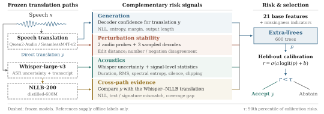
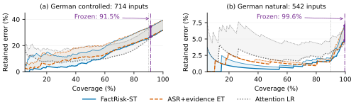
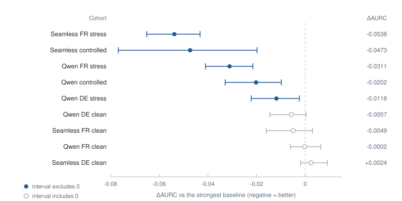

# FactRisk-ST

**面向语音翻译数字保真度的无参考风险估计。**

*双盲评审期间的匿名代码发布。* &nbsp;|&nbsp; [English](README.md) · **简体中文**

**9 个队列 · 2 个后端 · 9 个成对区间中 5 个排除零 · 一套冻结协议**

---



## 一页看懂主线

- **问题。** 句子级指标对整句输出打分，单个数字替换会被整体稀释；它们既不核验局部数字，也不支持“接受或弃答”的决策。
- **做法。** 冻结的 ST 模型加一个无参考风险头，用四个信号族估计“参考数字未被保留”的概率；保留误差以识别界报告，无法判定的标签留在分母中。
- **发现。** 识别–翻译路径在九个队列中的八个承担风险排序。排序跨语言与后端迁移；而校准过的阈值不迁移，因为校准编码了源域的标签分布。
- **含义。** 风险头可直接部署，只有阈值需要在目标域重选；重选只需要目标域的风险分数，不需要标签。

## 1. 问题

语音翻译（ST）系统可以把 “sixteen” 译成 “seventeen”，而输出的其余内容依然流畅正确。在字幕后期编辑、会议记录与语音信息检索中，读者只看到译文，被悄悄改动的数字不会被察觉。数字在这些场景里承载着信息本身。

BLEU、chrF、COMET、学习式质量估计等句子级指标对整句输出打分，单个数字替换会被整体稀释；它们也回答不了下游用户真正关心的两个问题：*这一处数字是否忠实？* 以及 *该接受这个片段还是弃答？* 选择性分类为第二个问题提供了风险–覆盖（risk–coverage）框架，但没有提供能预测数字错误的信号。

## 2. 方法

FactRisk-ST 在没有参考译文的情况下为单个译段打分。冻结的 ST 模型产生译文，随后由 Extra-Trees 头估计“参考数字未被保留”的概率，特征来自四个信号族：

| 信号族 | 代表特征 | 刻画对象 |
|---|---|---|
| 文本 / 解码器 | `sequence_nll`、`token_entropy`、`beam_margin_risk`、`output_length` | 生成译文自身的不确定性 |
| 声学 | `asr_sequence_nll`、`asr_token_entropy`、`audio_spectral_entropy`、`audio_rms_db` 等 | 音频本身是否难处理 |
| 扰动稳定性 | `perturb_mean_distance`、扰动最大距离、多次采样不一致度 | 输出对输入微小变化的敏感度 |
| 识别–翻译路径 | `cascade_sequence_nll`、`evidence_text_distance`、`evidence_fact_mismatch`、`evidence_coverage_gap` | 直接翻译与独立“先识别再翻译”路径之间的一致性 |

保留误差以**识别界（identification bounds）**报告：参考数字无法判定的片段留在分母中，而不是被丢弃。

决策阈值取风险分数的分位数，因此在新领域重选工作点只需要目标域的分数、不需要标签；而概率校准在源域拟合，不随之迁移。

## 3. 主要结果

九个队列、两个后端（Qwen2-Audio-7B-Instruct、SeamlessM4T-v2-large）、一个冻结协议：任何模型都不在评测队列上训练或调参。

### 主比较

AURC 越低越好。R90 是 top-90% 选择下保留误差的识别界 [E/K, (E+U)/K]（受控 K=643、自然 clean K=488），不是置信区间；粗体为该队列最优。

| 方法 | 受控 AURC | 受控 R90 (%) | 自然 clean AURC | 自然 clean R90 (%) |
|---|---:|---:|---:|---:|
| *Qwen2-Audio* | | | | |
| Beam NLL summary | 0.3080 | 29.24–37.48 | 0.0252 | 5.12–7.17 |
| Hypothesis NLL | 0.2582 | 28.77–37.01 | 0.0235 | 4.92–6.76 |
| Token entropy | 0.2320 | 28.62–36.86 | 0.0214 | 4.71–6.76 |
| COMET-QE | 0.2234 | 25.82–33.90 | 0.0386 | 5.12–6.97 |
| Evidence ET | 0.1652 | 26.13–34.06 | 0.0163 | 1.64–2.05 |
| Attention LR | 0.1466 | 24.57–32.97 | 0.0263 | 3.07–5.12 |
| ASR+evidence ET | 0.1425 | 25.66–33.59 | 0.0148 | 1.84–2.25 |
| **FactRisk-ST** | **0.1223** | 25.82–33.75 | **0.0092** | 1.64–2.05 |
| *SeamlessM4T-v2* | | | | |
| Evidence ET | 0.2592 | 25.51–32.97 | 0.0045 | 0.41–0.61 |
| Beam NLL summary | 0.2167 | 26.91–34.37 | 0.0115 | 1.43–1.64 |
| ASR+evidence ET | 0.2097 | 26.75–34.06 | **0.0040** | 0.41–0.61 |
| **FactRisk-ST** | **0.1623** | 24.42–31.88 | 0.0064 | 0.82–1.02 |



### 跨九个队列的显著性

Δ 为 FactRisk-ST 的 AURC 减去最强基线（ASR+evidence Extra Trees）的 AURC，负值更好；簇为 speaker–donor 连通分量。



| 队列 | ΔAURC | 95% 区间 | 簇数 |
|---|---:|---|---:|
| Qwen 受控诊断集 | -0.0202 | [-0.0329, -0.0098] | 7 |
| Qwen 德英压力集 | -0.0118 | [-0.0222, -0.0024] | 235 |
| Seamless 受控诊断集 | -0.0473 | [-0.0768, -0.0198] | 7 |
| Qwen 法英压力集 | -0.0311 | [-0.0410, -0.0215] | 371 |
| Seamless 法英压力集 | -0.0538 | [-0.0651, -0.0432] | 371 |
| Seamless 德英 clean | +0.0024 | [-0.0019, +0.0091] | 506 |
| Qwen 德英 clean | -0.0057 | [-0.0145, +0.0004] | 506 |
| Qwen 法英 clean | -0.0002 | [-0.0061, +0.0064] | 841 |
| Seamless 法英 clean | -0.0049 | [-0.0160, +0.0030] | 841 |

九个队列中有五个的区间排除零，四个不能排除；在 Seamless 德英 clean 上点估计甚至偏向基线。因此我们主张的是**随领域变化的增益，而非普遍优于基线**。

### 跨整个网格成立的两条结论

- **排序可迁移，阈值不可迁移。** 识别–翻译路径在九个队列中的八个承担风险排序。排序跨语言与后端稳定；但在受控德英语音上拟合的阈值（它能接受 99.6% 的自然德英 clean 语音）可以让 Seamless 法英压力集的风险升高 4.6–7.4 个百分点。
- **在关键场景上，选择显著收紧保留误差。** 在自然德英 clean 语音上，取 top-90% 使保留误差界从 5.17–7.38% 降到 1.64–2.05%。在最大的压力队列（1,626 条输入、472 个已知错误）上，同一套无标签规则给出 24.95–28.50%，基线为 24.88–28.57%，点估计持平。

### 法英迁移

冻结迁移，不做任何法语相关的调参。F/B 为 FactRisk-ST 对 ASR+evidence；区间为 AURC 差值在 speaker–donor 连通分量上的成对 95% CI。

| 设置 | AURC F/B | Δ 95% CI |
|---|---|---|
| Qwen clean | 0.0193 / 0.0195 | [-0.0061, 0.0064] |
| Seamless clean | 0.0153 / 0.0202 | [-0.0160, 0.0030] |
| Qwen 压力集 | 0.2291 / 0.2601 | [-0.0410, -0.0215] |
| Seamless 压力集 | 0.1795 / 0.2333 | [-0.0651, -0.0432] |

完整的分队列数字、成对显著性汇总与出处记录随论文的评测包提供。

## 4. 适用范围与限制

- 研究对象是**一个可局部核验的性质**：数字保持。其他事实错误、流畅度与整体充分性不在本文估计范围内。
- 标签由自动流程产生并经过一致性审计，不是新增的人工评测；报告中的“真”指标均为操作性定义。
- 增益随领域变化：自然 clean 语音上的区间大多含零或无差异，受控诊断集仅有 7 个簇，因此那里的结论属于高方差的小样本比较。
- 成本上，完整串行流程约为仅解码 ST 的 3.9 倍；该测量是同批 64 条录音上各阶段求和，不含模型加载与调度开销。
- 方法在冻结的 ST 模型之上工作，不修改翻译器本身。

## 5. 仓库结构

- `src/factrisk/`：唯一维护的 Python 包，按职责分组 —— `core/`（IO、产物契约、标签与数字原语、模型注册、分片与冻结输入封存）、`backends/`（Qwen2-Audio、SeamlessM4T、Whisper 适配器，音频变换，注意力探针）、`datasets/`、`method/`（风险特征与匹配头）、`eval/`（指标、统计汇总、稳健性门限）、`pipeline/`（端到端阶段）、`french/`（法英迁移子项目）、`paper/`、`cli/`。
- `configs/paper.yaml`：论文实验的完整规格 —— 风险特征组、主模型与模型选择、增强条件。
- `docs/`：评测协议、自动评测政策与运行手册。
- `scripts/`：阶段、实验、法英、冒烟与论文构建入口。
- `tests/`：与 `src/factrisk` 同构的验证。

## 6. 环境与入口

```bash
python -m pip install -e . --no-deps

bash scripts/run_stage.sh audit          # 单个阶段
bash scripts/run_experiments.sh          # 完整实验流程
bash scripts/smoke.sh                    # 冒烟自检
```

已完成的实验不应重跑，除非有意替换其冻结协议。

## 7. 本仓库不包含的内容

出于体量、许可与匿名评审的考虑，以下内容未随本仓库发布：原始与派生音频数据、逐样本预测与冻结评测产物、论文的 LaTeX 源与构建产物、以及各后端模型权重。
